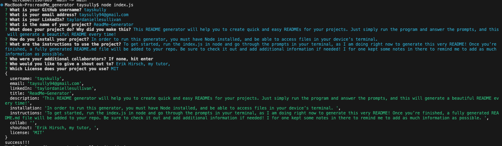

# ReadMe-Generator

## This README generator will help you to create quick and easy READMEs for your projects. Just simply run the program and answer the prompts, and this will generate a beautiful README every time!

To go into more detail, refer to these questions:
- What was your motivation?
- Why did you build this project?
- What problem does it solve?
- What did you learn?

## Table of Contents
 
- [Installation](#installation)
- [Usage](#usage)
- [Credits](#credits)
- [License](#license)
- [Questions](#questions)

## Installation

In order to run this generator, you must have Node installed, and be able to access files in your device’s terminal. 

## Usage

To get started, run the index.js in node and go through the prompts in your terminal, as I am doing right now to generate this very README! Once you’re finished, a fully generated README.md file will be added to your repo. Be sure to check it out and add additional information if needed! I for one kept some notes in there to remind me to add as much information as possible. 

  

## Contributing

The collaborators on this project include me, myself, and I -- tayskully
   

Tutorials followed include Columbia University EdX's Coding Bootcamp 2023, as well as:  
 [Github Docs](https://docs.github.com/en)  
 [developer mozilla](https://developer.mozilla.org/en-US/)  
 [Dev.to](https://dev.to/)  
 [Code Academy blogs](https://www.codecademy.com/resources/blog/)  
 [W3 Schools](https://www.w3schools.com/)

Special thanks to Erik Hirsch, my tutor, for the additional guidance 

## License 
    MIT License

## Questions

Reach out to me if you have any questions!
- Github: tayskully
- LinkedIn: taysully
- Email: taysully94@gmail.com

---

## Badges

